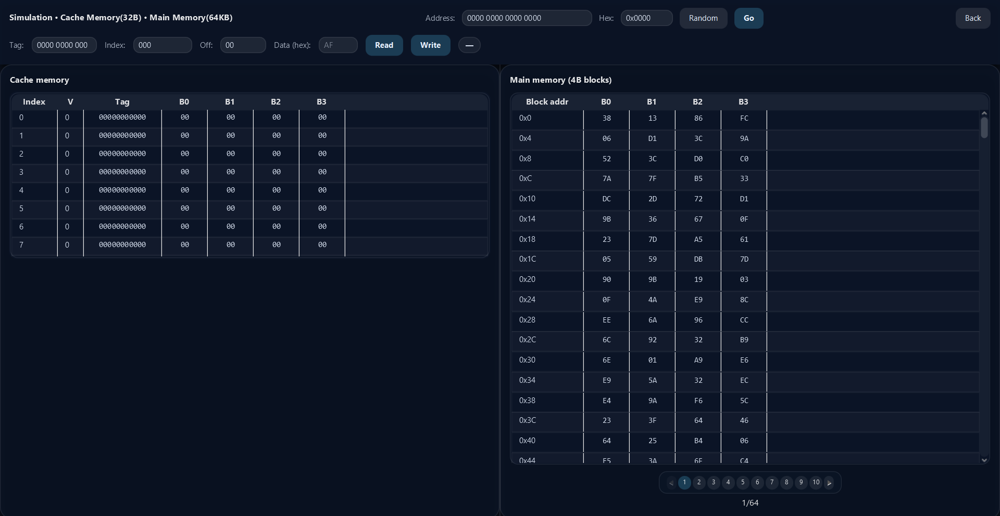
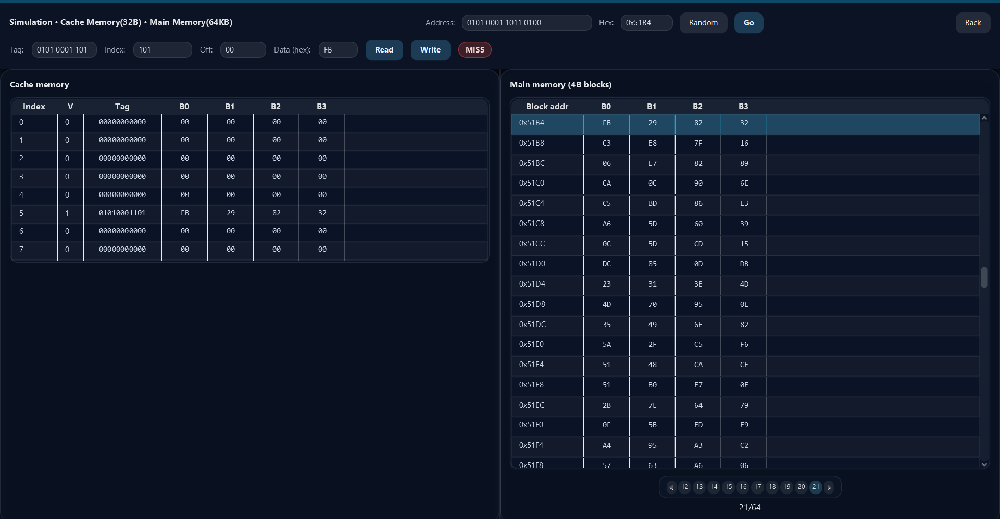
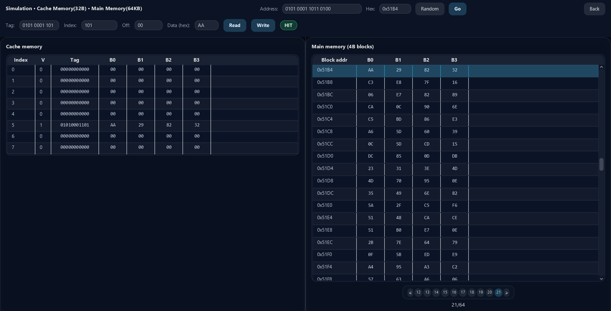

🧠 Cache Memory Simulator
Welcome to the Cache Memory Simulator! This application is an interactive, visual educational tool designed to demonstrate exactly how a CPU interacts with cache and main memory. It allows users to simulate low-level memory operations, track hits and misses, and observe data movement in real-time.

📖 Project Overview
Understanding cache memory is crucial for computer architecture, and this simulator brings those concepts to life. By allowing you to customize memory dimensions and execute read/write commands, the app reveals the hidden mechanics of memory addressing, block fetching, and write policies. You can monitor the exact state of both the Cache and the Main Memory simultaneously on the dashboard.

✨ Key Features
Customizable Dimensions: Fully configure the sizes for both the Cache Memory and the Main Memory before starting the simulation.

Direct Mapped Architecture: Implements a strict direct-mapped cache where each block from main memory has a single, specific line it can occupy in the cache.

Byte Addressable: The memory simulates real-world byte-level addressing, fetching complete blocks but allowing precise single-byte reads and writes.

Read & Write Operations: Manually input addresses to perform Read or Write operations and instantly see whether the result is a HIT or a MISS.

Random Address Generation: Use the built-in randomizer to quickly generate valid memory addresses and test the cache's performance on the fly.

Complete Memory Visibility: The UI provides a full, real-time view of the entire contents of both the Cache Memory (Valid bits, Tags, Data blocks) and the Main Memory.

⚙️ Memory Policies
Write-Through: Ensures absolute data consistency. Whenever a write operation occurs, the data is synchronously written to both the cache and the main memory.

Write-Allocate: On a write MISS, the simulator fetches the required block from main memory, allocates it into the cache, and then performs the write operation.

🔍 Address Decoding Visualization
To help bridge the gap between abstract addresses and physical memory mapping, the simulator breaks down every memory address you input.

The application takes the full memory address and visually divides it into its core hardware components:

Tag Field: Identifies if the stored block matches the requested memory.

Index Field: Locates the specific line within the cache.

Offset Field: Locates the exact byte within the fetched block.

Note: All address breakdowns are displayed in both Binary and Hexadecimal formats for easy verification!

📸 Screenshots

Above: An overview of the initial state of the cache memory and main memory content.

Above: A read operation performed right after initialization resulted in a MISS on the cache, because that address was never accessed before.

Above: A write operation resulted in a HIT on the cache, because of the read operation performed earlier at that address.

🚀 Getting Started
Prerequisites
Java JDK installed on your machine.

An IDE (like IntelliJ IDEA or Eclipse) to run the project.

Running the App

Clone the repository:
git clone https://github.com/Adelinn77/Cache-Memory-Simulation-App.git

Open the project in your IDE.

Run the main application file to launch the simulator interface.

Configure your memory sizes, hit Start, and begin reading and writing data!

Author: Adelinn77
